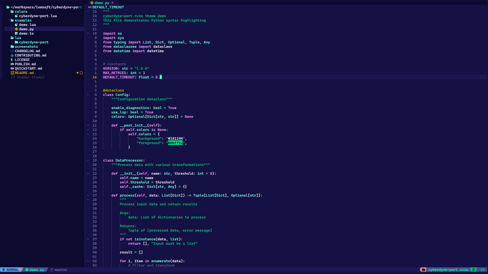

# Publishing Guide

This guide will help you publish cyberdyne-port.nvim to GitHub.

## Prerequisites

1. GitHub account
2. Git configured with your credentials
3. This repository initialized (already done!)

## Steps to Publish

### 1. Create a new repository on GitHub

1. Go to https://github.com/new
2. Repository name: `cyberdyne-port.nvim`
3. Description: `A cyberpunk-inspired Neovim colorscheme based on Ghostty Cyberdyne`
4. Choose Public
5. **DO NOT** initialize with README, .gitignore, or license (we already have these)
6. Click "Create repository"

### 2. Push to GitHub

Replace `yourusername` with your actual GitHub username:

```bash
cd ~/workspace/lemsoft/cyberdyne-port.nvim

# Add remote
git remote add origin https://github.com/yourusername/cyberdyne-port.nvim.git

# Rename branch to main (optional, but recommended)
git branch -M main

# Push to GitHub
git push -u origin main
```

### 3. Update README.md

After publishing, update the installation examples in README.md:
- Replace `yourusername` with your actual GitHub username
- Update all installation instructions to point to your repo

```bash
# Example: Find and replace
sed -i 's/yourusername/ACTUAL_USERNAME/g' README.md

# Commit the changes
git add README.md
git commit -m "Update username in installation instructions"
git push
```

### 4. Add Topics to Repository

On GitHub, go to your repository page and add topics:
- `neovim`
- `neovim-theme`
- `neovim-colorscheme`
- `colorscheme`
- `theme`
- `cyberpunk`
- `ghostty`
- `lua`

### 5. Add Screenshots (Optional but Recommended)

1. Take screenshots of your editor with the theme
2. Add them to the `screenshots/` directory
3. Update README.md to include the images:

```markdown
## Screenshots



```

4. Commit and push:

```bash
git add screenshots/
git add README.md
git commit -m "Add screenshots"
git push
```

### 6. Create a Release (Optional)

1. Go to your repository on GitHub
2. Click "Releases" → "Create a new release"
3. Tag version: `v0.1.0`
4. Release title: `v0.1.0 - Initial Beta Release`
5. Description: Copy from CHANGELOG.md
6. Click "Publish release"

### 7. Submit to Neovim Plugin Lists (Optional)

- [Awesome Neovim](https://github.com/rockerBOO/awesome-neovim) - Add your theme to the colorscheme section
- [Neovimcraft](https://neovimcraft.com) - Submit your plugin
- Share on Reddit: r/neovim

## Post-Publication Checklist

- [ ] Repository is public
- [ ] README.md has correct installation instructions
- [ ] Topics are added
- [ ] License is visible
- [ ] Repository has a description
- [ ] Screenshots are added (optional but recommended)
- [ ] Release is created

## Maintenance

### Updating the Theme

1. Make your changes
2. Update CHANGELOG.md
3. Commit and push:

```bash
git add .
git commit -m "Description of changes"
git push
```

### Creating New Releases

```bash
# Tag the release
git tag -a v0.2.0 -m "Release v0.2.0"
git push origin v0.2.0
```

Then create the release on GitHub.

## Need Help?

- Check GitHub's [Creating a repository](https://docs.github.com/en/repositories/creating-and-managing-repositories/creating-a-new-repository) guide
- See [About releases](https://docs.github.com/en/repositories/releasing-projects-on-github/about-releases)

Good luck with your theme! 🚀
