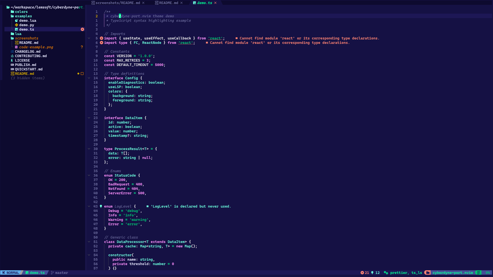

# 🌌 cyberneon.nvim

A cyberpunk neon-inspired Neovim colorscheme. Inspired by Ghostty Cyberdyne terminal theme.

Dark blue depths meet acid green highlights in this futuristic theme that brings the essence of cyberpunk aesthetics to your editor.

## Screenshots




## ✨ Features

- 🎨 Authentic Ghostty Cyberdyne color palette
- 🌳 Full TreeSitter support
- 🔍 LSP diagnostics integration
- 📦 Works with all major plugin managers
- 🎯 Support for popular plugins:
  - Telescope
  - Neo-tree / NvimTree
  - WhichKey
  - GitSigns
  - Dashboard / Alpha
  - Noice
  - Indent Blankline
  - and more!

## 🎨 Color Palette

| Color | Hex | Preview | Usage |
|-------|-----|---------|-------|
| Background | `#151144` |  | Main background |
| Foreground | `#00ff92` |  | Main text, variables, calls |
| Black | `#080808` |  | Terminal color |
| Red | `#ff8373` |  | Errors, git deleted |
| Green | `#00c172` |  | Strings, git added |
| Yellow | `#d2a700` |  | Warnings, search |
| Blue | `#0071cf` |  | Terminal color |
| Magenta | `#ff90fe` |  | Keywords (if, for, const, etc.) |
| Cyan | `#6bffdd` |  | Functions, types |
| White | `#f1f1f1` |  | Comments, inactive text |

## 📦 Installation

### [lazy.nvim](https://github.com/folke/lazy.nvim)

```lua
{
  "followLemmi/cyberneon.nvim",
  lazy = false,
  priority = 1000,
  config = function()
    vim.cmd([[colorscheme cyberneon]])
  end,
}
```

### [packer.nvim](https://github.com/wbthomason/packer.nvim)

```lua
use {
  "followLemmi/cyberneon.nvim",
  config = function()
    vim.cmd([[colorscheme cyberneon]])
  end
}
```

### [vim-plug](https://github.com/junegunn/vim-plug)

```vim
Plug 'followLemmi/cyberneon.nvim'

" In your init.vim or after plug#end()
colorscheme cyberneon
```

### [pckr.nvim](https://github.com/lewis6991/pckr.nvim)

```lua
{
  "followLemmi/cyberneon.nvim",
  config = function()
    vim.cmd([[colorscheme cyberneon]])
  end
}
```

### [dein.vim](https://github.com/Shougo/dein.vim)

```vim
call dein#add('followLemmi/cyberneon.nvim')

" After dein setup
colorscheme cyberneon
```

## 🔧 Configuration

### Basic Usage

```lua
-- In your init.lua
vim.cmd([[colorscheme cyberneon]])
```

### With AstroNvim

In your `~/.config/nvim/lua/plugins/astroui.lua`:

```lua
return {
  "AstroNvim/astroui",
  opts = {
    colorscheme = "cyberneon",
  },
}
```

### With LazyVim

```lua
-- In ~/.config/nvim/lua/plugins/colorscheme.lua
return {
  {
    "followLemmi/cyberneon.nvim",
  },
  {
    "LazyVim/LazyVim",
    opts = {
      colorscheme = "cyberneon",
    },
  },
}
```

### With LunarVim

In your `~/.config/lvim/config.lua`:

```lua
lvim.colorscheme = "cyberneon"
lvim.plugins = {
  { "followLemmi/cyberneon.nvim" },
}
```

### With NvChad

In your `~/.config/nvim/lua/chadrc.lua`:

```lua
M.ui = {
  theme = "cyberneon",
}

M.plugins = "custom.plugins"
```

And in `~/.config/nvim/lua/custom/plugins.lua`:

```lua
return {
  { "followLemmi/cyberneon.nvim" },
}
```

## 🌟 Credits

This theme is inspired by the [Ghostty](https://ghostty.org) Cyberdyne color scheme.

## 📝 License

MIT License - see [LICENSE](LICENSE) for details

## 🤝 Contributing

Contributions are welcome! Feel free to open issues or submit pull requests.

## 🔗 Related

- [Ghostty Terminal](https://ghostty.org) - A fast, native, GPU-accelerated terminal emulator
---

Made with 💚 for the cyberpunk aesthetic
